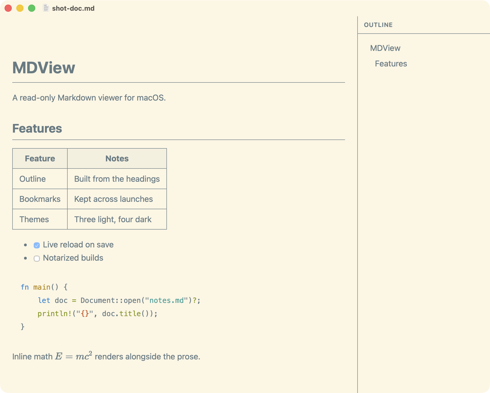

# MDView

A read-only Markdown viewer for macOS. Rust and AppKit, with WebKit used only
as a paint surface.



Point it at a file and read. There is no editor, no preview pane to keep in
sync, and no server: every asset is embedded in the binary, so it renders the
same with the network off.

## What it renders

CommonMark plus GFM tables and task lists, syntax-highlighted code, images,
LaTeX math, and Mermaid diagrams.

## What it does

- **Outline** built from the document's headings, in a sidebar you can toggle
  and drag to resize; the width is remembered across launches.
- **Bookmarks** for documents you come back to, kept across launches.
- **Themes** — three light, four dark, or follow the system. Hovering a name
  in the picker previews it on the document; only a click keeps it.
- **Click to zoom** an image or a Mermaid diagram to fill the window.
- **Live reload.** Save in your editor and the view updates, holding your
  scroll position.
- **One window.** Opening another document reuses the current window rather
  than scattering windows across the desktop.

## Install

Grab `MDView-<version>.dmg` from the releases page and drag it to
Applications. Universal binary, so one download covers Apple silicon and
Intel.

It is ad-hoc signed, not notarized, so Gatekeeper blocks the first launch:

```sh
xattr -d -r com.apple.quarantine /Applications/MDView.app
```

Or **System Settings → Privacy & Security → Open Anyway**. Control-clicking no
longer works for this; Sequoia removed that shortcut. There is no Homebrew
cask, because Homebrew stops supporting casks that fail Gatekeeper on
1 September 2026 and notarizing needs a paid Apple Developer account.

For the `mdview` command:

```sh
ln -sf /Applications/MDView.app/Contents/Resources/mdview /usr/local/bin/mdview
```

Building from source instead:

```sh
make install       # /Applications/MDView.app
make install-cli   # /usr/local/bin/mdview
```

## Use

```sh
mdview notes.md               # open a file
mdview --print-html notes.md  # render to stdout
```

Or double-click a `.md` file in Finder, drop one on the window or the Dock
icon, or press ⌘O.

| Key | |
| --- | --- |
| ⌘O | Open a file |
| ⌘R | Reload |
| ⌥⌘S | Toggle the sidebar |
| ⌥⌘F | Toggle fullwidth view |
| ⌥⌘D | Toggle Git diff view |
| ⌘D | Bookmark this document |
| ⌘W | Close the window |
