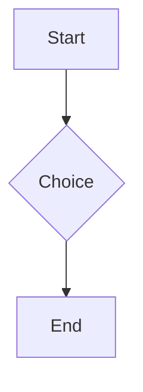

A rust block:

```rust
fn main() {
    println!("hi <world> & friends");
}
```

An unlabelled block:

```
plain text < > &
```

A mermaid diagram:



An unterminated fence follows:

```python
print("no closing fence")
