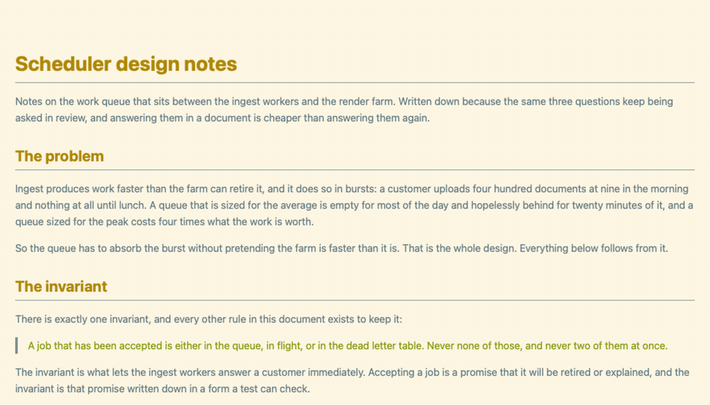
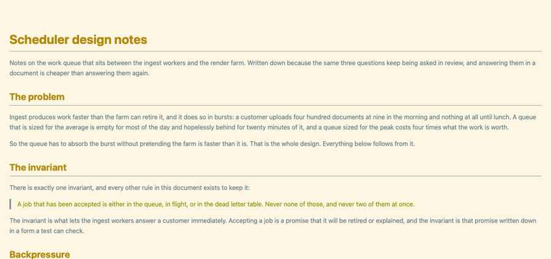
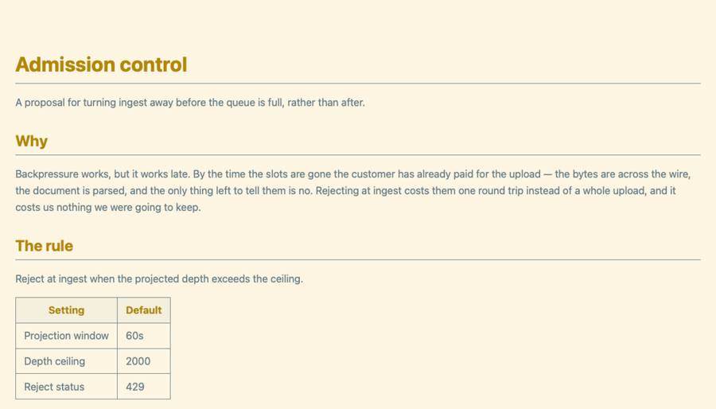
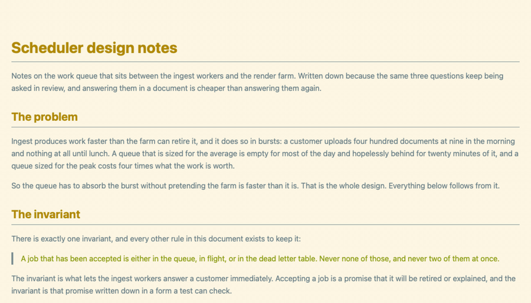
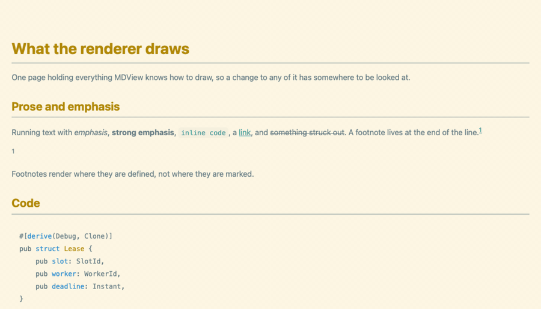
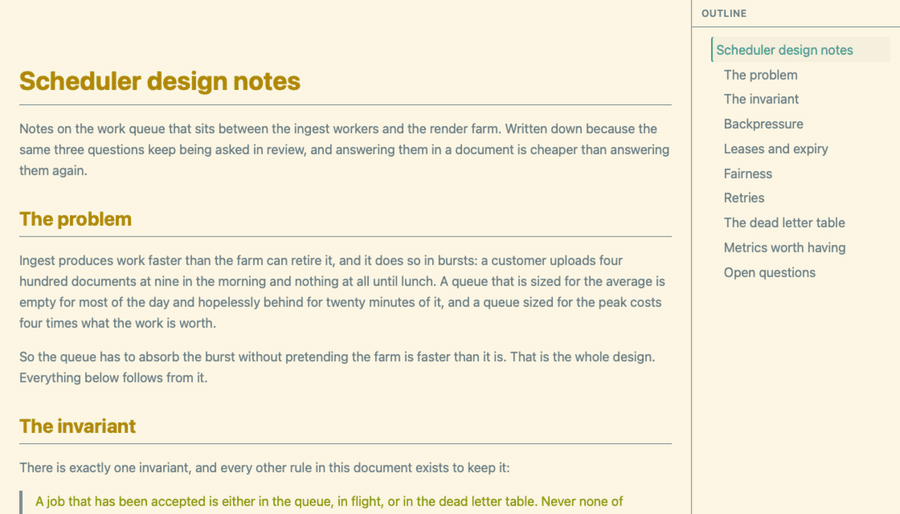

# A tour of MDView

The [README](../README.md) lists what MDView does. This shows it, grouped by
what you are actually doing when you reach for each thing.

These are recordings of the page, not of the window — the same WebKit the app
draws into, driven by the same keys, without the title bar around it. They are
generated from the running renderer by `make reels`, so they are rebuilt when
the interface changes rather than re-shot by hand.

## Reading something long

`}` and `{` step between top-level headings, `]` and `[` between all of them.
The outline in the sidebar lights the heading you are reading rather than the
one you clicked, and keeps it in view, so it says where you are and not just
what there is.

`g m` puts the shape of the whole document down the right edge: headings as
bars, prose as lines, code and tables as blocks. The band is the part you are
reading. It floats over the margin rather than taking width from the text, so
turning it on does not re-wrap what you are reading.

## Finding your way

`/` highlights every match as you type; enter hands the keyboard back to the
document so `n` and `N` step through them, and esc clears the highlights.

`:` opens the commands this app has of its own, with the key for each printed
beside it — type a few letters, run what you find, and leave knowing the key.
The vim alphabet is deliberately not in that list; `?` prints the lot.

## Reviewing a draft with Claude

Select a phrase — with the mouse, or with `v` and a motion — press `c`, and
type a note. The passage stays highlighted and the note is filed against it,
in the document's right margin when the window is wide enough for one and in
the sidebar when it is not.

`C` copies a prompt that points Claude at the review file holding the notes,
and asks it to delete each comment it has addressed. MDView watches that file,
so a comment leaves as soon as it is dealt with. A comment whose passage was
rewritten instead stays, struck through, rather than vanishing with the words
it was about.

## Seeing what changed

`g d` shows what has changed since the last commit, and `g l` lays it out four
ways. The source layouts go line by line, which is the view for checking a
table's pipes. Rendered shows the document as it renders, with a bar beside
every block that changed and the version that was there before folded away
under it — the outline and the minimap keep working there, because it is still
the document. Rendered split puts the two documents side by side instead,
which is the one to reach for when a page has been rewritten rather than
edited.

## Coming back to a document

`m` bookmarks what you are reading and `g b` lists the bookmarks. `g r` opens
the last fifty documents in a palette you can type into — a few letters of the
name, or of the folder it is in, narrows the list. The document you are
reading is not in it, so `g r` and enter is "back to the one before this".

## What it renders

CommonMark plus GFM tables and task lists, syntax-highlighted code, images,
LaTeX math, and Mermaid diagrams — all of it embedded in the binary, so it
renders the same with the network off. `z` fills the window with whichever
image or diagram you are looking at, and the arrows pan it once it is there.

## Making it yours

`g t` opens the themes in a palette you can type into. Arrowing through it
previews each one on the document, and only enter keeps it. The document takes
the palette's own colours, not just the code inside it: headings, links,
inline code, emphasis and table headings all come from what the theme says
about Markdown, so a page reads the way it does in the editor the theme came
from.

## What these cannot show

The recordings are the page. Four things live in the window around it, and
belong in the app rather than in a GIF:

- **Live reload.** Save in your editor and the document re-renders in place,
  holding your scroll position. There is no editor in a recording, so there is
  nothing to film.
- **Opening files.** ⌘O, a file dropped on the window or the Dock icon,
  `mdview notes.md` from a shell, or Open With from Finder.
- **The menu bar.** Every command has a menu item, which is how a mouse
  reaches it. The recordings are the page; the menu bar is the window.
- **The window itself** — the title bar, and opening a second document into
  the same window rather than scattering windows across the desktop.

## Every key

The [shortcut table in the README](../README.md#use) is the list, and it is
checked against the menu definitions by the test suite. `?` prints the same
thing inside the app.
