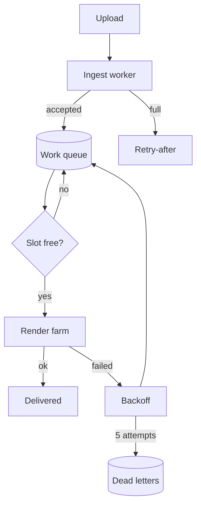
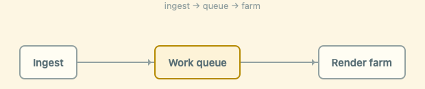

# What the renderer draws

One page holding everything MDView knows how to draw, so a change to any of it
has somewhere to be looked at.

## Prose and emphasis

Running text with *emphasis*, **strong emphasis**, `inline code`, a
[link](https://example.com), and ~~something struck out~~. A footnote lives at
the end of the line.[^1]

[^1]: Footnotes render where they are defined, not where they are marked.

## Code

```rust
#[derive(Debug, Clone)]
pub struct Lease {
    pub slot: SlotId,
    pub worker: WorkerId,
    pub deadline: Instant,
}

impl Lease {
    pub fn expired(&self, now: Instant) -> bool {
        now >= self.deadline
    }
}
```

```bash
scheduler queue --depth --tenant acme | jq '.depth'
```

## Tables

| Layout | Reads | Best for |
| --- | :-: | --- |
| Unified | line by line | a table's pipes |
| Split | two columns | a rewritten line |
| Rendered | the document | prose, as it renders |
| Rendered split | two documents | a page rewritten whole |

## Task lists

- [x] Absorb the burst
- [x] Bound the retries
- [ ] Weighted shares
- [ ] Admission control

## Math

Inline, $t_n = 2^n \cdot 500\,\text{ms}$, sits in the line without disturbing
it. Displayed, it gets the room:

$$
\text{depth}(t) = \int_{0}^{t} \bigl(\lambda(s) - \mu\bigr)\, ds
$$

## Diagrams



## Pictures



## Quotes and rules

> A queue that never says no is a queue that eventually says nothing at all.

---

That rule above is a rule. A `---` at the top of a file that closes is
frontmatter and is taken off before any of this is drawn.
